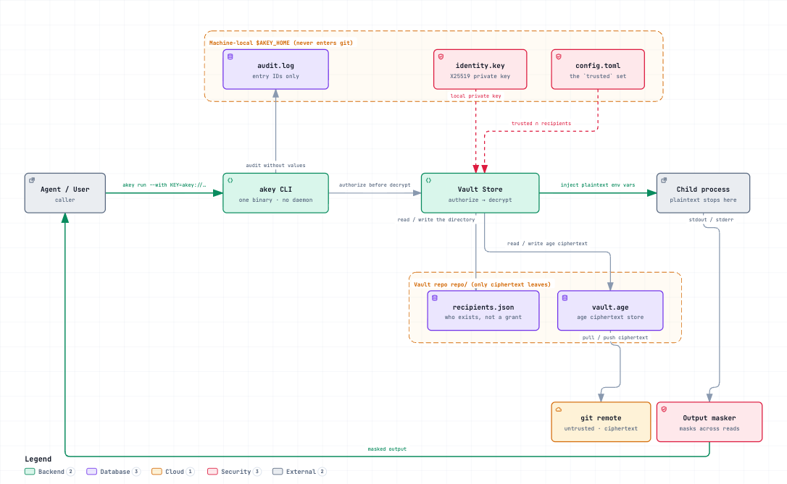
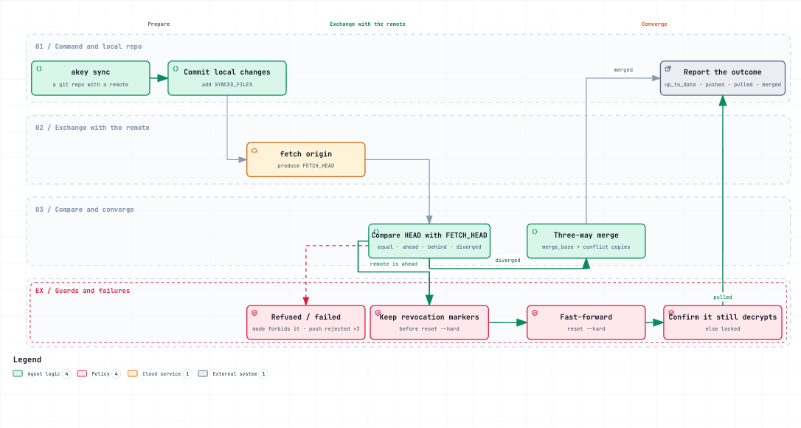
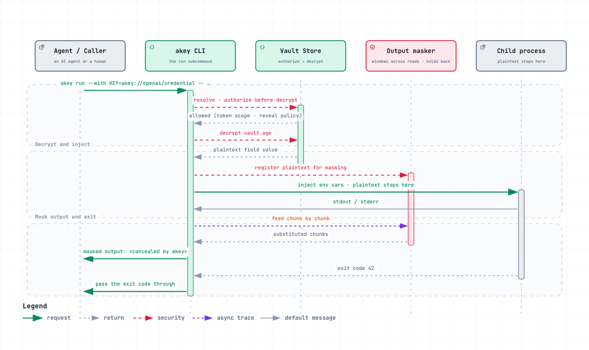

# akey

[](https://github.com/coder-knock/akey/actions/workflows/ci.yml)
[](https://github.com/coder-knock/akey/releases)
[](LICENSE)

**An encrypted credential vault for AI agents.** One Rust binary. No daemon, no server. Ciphertext
syncs between your machines through a git remote you already own.

> ```bash
> akey run --with OPENAI_API_KEY=akey://openai/credential -- curl -sS https://api.openai.com/v1/models
> ```
>
> The child process gets the real value. The agent's stdout gets `<concealed by akey>`.

That is the whole product: **an agent can use a secret without ever seeing it.** A `.env` file can
only promise the opposite — the moment the agent reads the variable, the plaintext is in its
context, and in every log and transcript that follows.

> 中文文档：[README.zh-CN.md](README.zh-CN.md) · [docs/AGENT-INTEGRATION.zh-CN.md](docs/AGENT-INTEGRATION.zh-CN.md)

---

## Why not a plaintext `.env`

| | plaintext `.env` | akey |
|---|---|---|
| The AI reads the key | Yes — and once it is in the context, it is gone for good | No. Only the child process gets it |
| Several machines | Sync by hand | `akey sync` |
| Encryption at rest | None | age: X25519 + ChaCha20-Poly1305 |
| Laptop stolen | Rotate every key | `akey devices rm <that one>` — it stops working immediately |
| Least privilege for CI | Hand over the full key | `akey token create --allow openai --ttl 30d` |
| A compromised remote | Everything leaks | Only a directory entry is added; no ciphertext follows |
| Audit trail | None | `akey log` |

## Install

**macOS and Linux** — downloads the release for your platform, verifies its SHA-256, and falls
back to building from source if there is no matching binary:

```bash
curl -fsSL https://raw.githubusercontent.com/coder-knock/akey/main/install.sh | sh
```

**Windows** (x86_64 and arm64):

```powershell
irm https://raw.githubusercontent.com/coder-knock/akey/main/install.ps1 | iex
```

**From source**, on any platform with [Rust](https://rustup.rs) ≥ 1.85:

```bash
cargo install --git https://github.com/coder-knock/akey --locked
```

| Platform | Prebuilt | Notes |
|---|---|---|
| macOS arm64 / x86_64 | yes | |
| Linux x86_64 / aarch64 | yes | static musl — runs on any distro regardless of glibc |
| Windows x86_64 / arm64 | yes | not yet exercised end to end; see [Status](#status) |

Anything else: `cargo install --git …`, or `install.sh --from-source`. The only runtime dependency
is `git`, and only for `sync` — every other command works offline.

Both installers take `--version <tag>`, `--dir <path>`, `--from-source`, and `--force`, and honour
`AKEY_VERSION`, `AKEY_INSTALL_DIR`, and `AKEY_HOME`. Run either with `--help` for the rest.

## Five-minute start

```bash
# 1. Create a vault. Omit --remote for a purely local one; --recovery lets you
#    attach a new machine later with one passphrase.
akey init --remote git@github.com:you/akey-vault.git --device macbook --recovery

# 2. Store a key. The secret goes over stdin, so it never lands in your shell history.
printf 'credential=sk-proj-9f2a7c1e4b\n' | akey set openai --category apikey --stdin

# 3. See what you have — metadata only, never values.
akey list

# 4. Use it. This is the pose that matters.
akey run --with OPENAI_API_KEY=akey://openai/credential -- curl -sS https://api.openai.com/v1/models

# 5. Move to another machine, then approve it on every machine that already has the vault.
akey init --from git@github.com:you/akey-vault.git --device laptop   # asks for the recovery passphrase
akey devices trust laptop
```

## Command index

| | Commands |
|---|---|
| Lifecycle | `init` · `devices` · `recovery` · `token` · `sync` · `conflicts` · `resolve` |
| Entries | `get` · `set` · `edit` · `rm` · `restore` · `cp` · `mv` · `list` · `template` · `doc` |
| Delivery (for agents) | `run` · `inject` · `read` · `mcp` |
| Operations | `whoami` · `doctor` · `log` · `schema` · `completion` |
| Migration | `export` · `import` |

For flags and arguments, ask the tool: **`akey schema --json` is the authority**, and agents should
treat it as such. This table is for a human deciding whether any of it is useful.

### Language

Human-readable text is localized; `--json` never is, so an agent branches on `error.code` rather
than on prose.

```bash
akey --lang zh-CN list     # explicit; or AKEY_LANG=zh-CN, or $LC_ALL / $LC_MESSAGES / $LANG
```

`en` and `zh-CN` are supported. The one payload that does follow `--lang` is `akey schema`, whose
descriptions *are* the `--help` strings. Full contract in [DESIGN.md §16](DESIGN.md).

## Security model

**Each device holds its own X25519 private key**, stored only locally and never in git. The vault is
encrypted to every device that is both an active recipient and locally approved.

**No KDF on the hot path.** Day-to-day commands are X25519 + ChaCha20-Poly1305 — microseconds.
scrypt runs only during `init` and `recovery`, at roughly one second per guess for an attacker.

**Revealing plaintext is explicit, and refusable.** `get` conceals by default; `read` is the
plaintext channel. Both are gated by per-entry policy, `AKEY_NO_REVEAL`, and capability tokens.

**Masking covers secrets of 8 characters or more.** A shorter value is left alone, because masking
it would turn ordinary output into mosaic — `true`, `0`, `prod`, `us-east-1` all show up in real
logs. So a short secret is not concealed by `run`; treat it as printed in the clear.

**The remote does not decide who can read.** `recipients.json` is a directory of who exists; the
list of who may decrypt lives in your local config and never leaves the machine. Someone who
compromises the remote can add a public key there — it is reported as pending and receives nothing
until a human runs `akey devices trust`.

Lost laptop: `akey devices rm <name>` re-encrypts on the next sync. That machine can never open a
new revision again.

## Documentation

| | Reader | Contents |
|---|---|---|
| **[docs/AGENT-INTEGRATION.md](docs/AGENT-INTEGRATION.md)** | **AI agents** | How to integrate, how to recover from each exit code, what never to do |
| **[SKILL.md](SKILL.md)** | **agent harnesses** | The same material as a loadable skill definition |
| **[docs/SECURITY.md](docs/SECURITY.md)** | **security reviewers** | Threat model, nine attack simulations, findings and their status |
| [AGENTS.md](AGENTS.md) | agents **changing** akey | Architecture, conventions, frozen contracts |
| [REQUIREMENTS.md](REQUIREMENTS.md) | humans | Requirements and external contracts, incl. a feature-by-feature 1Password CLI comparison |
| [DESIGN.md](DESIGN.md) | humans | Data model, on-disk formats, algorithms, error taxonomy |
| [TESTPLAN.md](TESTPLAN.md) | humans | What each layer must prove |

`akey init` writes an `AGENTS.md` into the vault repository itself, so an agent that clones the
vault on a fresh machine can bootstrap with no external documentation.

The specification documents (REQUIREMENTS / DESIGN / TESTPLAN) are written in Chinese; the
agent-facing and landing documents are bilingual.

## Diagrams



**Architecture** — components and the two trust boundaries: what lives in `$AKEY_HOME` and never
enters git, versus what leaves as ciphertext. The return path from the child through the masker is
drawn explicitly.

<details>
<summary>Sync workflow and run sequence — previews and all six files</summary>



**Sync workflow** — `akey sync` across two machines: three convergence paths kept apart, and the
revocation guard placed before `reset --hard`.



**Run sequence** — `akey run` message by message: authorization before decryption, and masking
before anything reaches the caller.

| | English | 中文 |
|---|---|---|
| Architecture | [HTML](docs/diagrams/akey-architecture.en.html) · [spec](docs/diagrams/akey-architecture.en.json) | [HTML](docs/diagrams/akey-architecture.zh-CN.html) · [规格](docs/diagrams/akey-architecture.zh-CN.json) |
| Sync workflow | [HTML](docs/diagrams/akey-sync-workflow.en.html) · [spec](docs/diagrams/akey-sync-workflow.en.json) | [HTML](docs/diagrams/akey-sync-workflow.zh-CN.html) · [规格](docs/diagrams/akey-sync-workflow.zh-CN.json) |
| Run sequence | [HTML](docs/diagrams/akey-run-sequence.en.html) · [spec](docs/diagrams/akey-run-sequence.en.json) | [HTML](docs/diagrams/akey-run-sequence.zh-CN.html) · [规格](docs/diagrams/akey-run-sequence.zh-CN.json) |

</details>

Every figure is generated from the JSON spec beside it and ships as a standalone HTML file with
inline SVG — open one in a browser for pan, zoom, search, relationship tracing, dark/light, and
PNG or SVG export. Regeneration commands: [docs/diagrams/README.md](docs/diagrams/README.md).

## Status

**Available now.** The CLI is complete: **195 unit + 45 contract + 11 end-to-end tests**,
`cargo clippy` clean, a ~4 MB static release binary, and a worst-case vault read of 54 ms on a
1000-entry vault against a 100 ms budget.

**Platform support.** macOS and Linux are exercised end to end. Windows builds, its unit tests
pass, and the release workflow ships binaries for it — but the end-to-end suite drives a POSIX shell
(`sh -c`, `chmod`, `/dev/null`) and is gated to Unix, so Windows has compile-level and unit-level
coverage rather than a proven end-to-end path. Per-file ACLs are likewise not set; the code instead
requires the vault home to live inside the user profile.

**Roadmap.** Porting that Windows harness is next. A desktop GUI (gpuix) follows; in the meantime
`akey mcp` already lets an agent mount the vault directly — metadata only, never values.

## License

MIT — see [LICENSE](LICENSE).
