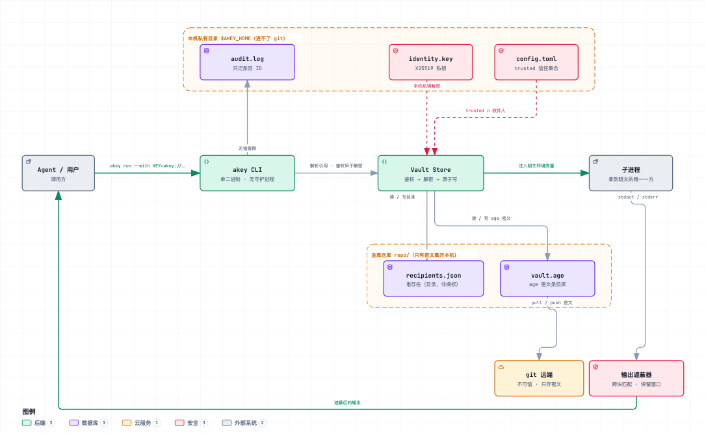
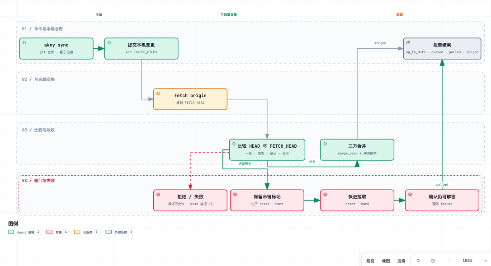
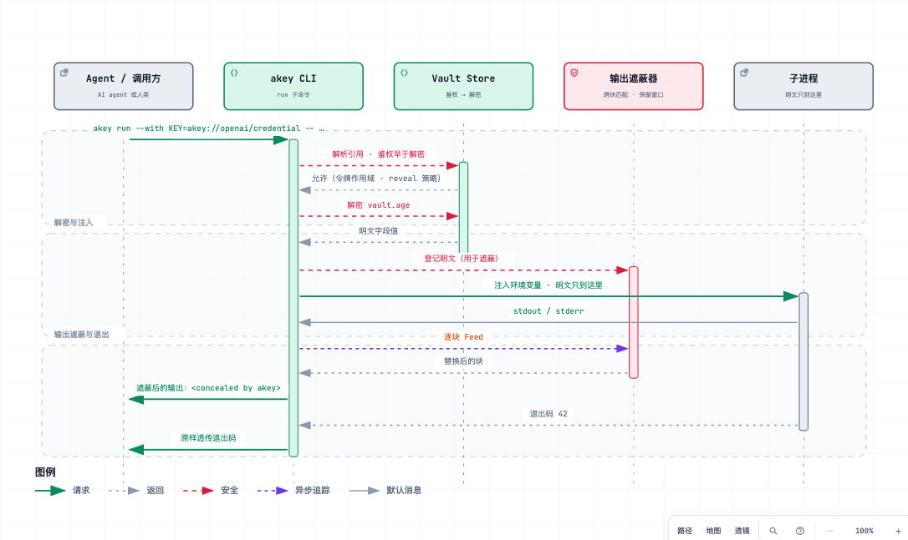

# akey

[](https://github.com/coder-knock/akey/actions/workflows/ci.yml)
[](https://github.com/coder-knock/akey/releases)
[](LICENSE)

**给 AI agent 用的加密凭证库。** 一个 Rust 单二进制。无守护进程、无服务端。密文通过你已有的
git 远程仓库在多台设备间同步。

> ```bash
> akey run --with OPENAI_API_KEY=akey://openai/credential -- curl -sS https://api.openai.com/v1/models
> ```
>
> 子进程拿到了真值；agent 的 stdout 里只有 `<concealed by akey>`。

这就是全部：**agent 能用上密钥，却从不看见它。** 明文 `.env` 只能承诺相反的事——agent 一读到那个
变量，明文就进了它的上下文，以及此后每一份日志与对话记录。

> English: [README.md](README.md) · [docs/AGENT-INTEGRATION.md](docs/AGENT-INTEGRATION.md)

---

## 为什么不是明文 `.env`

| | 明文 `.env` | akey |
|---|---|---|
| AI 读到 key | 会——进了上下文就收不回来 | 不会。只有子进程拿得到 |
| 多台机器 | 手动同步 | `akey sync` |
| 静态加密 | 无 | age：X25519 + ChaCha20-Poly1305 |
| 笔记本丢失 | 挨个轮换密钥 | `akey devices rm <那台>`，它当场失效 |
| 给 CI 降权 | 只能交出完整密钥 | `akey token create --allow openai --ttl 30d` |
| 远端被攻陷 | 全部泄漏 | 只多出一条目录记录，不会有任何密文跟着走 |
| 操作留痕 | 无 | `akey log` |

## 安装

**macOS 与 Linux** —— 下载对应平台的发布制品、校验 SHA-256；若没有匹配的二进制则自动回退到源码构建：

```bash
curl -fsSL https://raw.githubusercontent.com/coder-knock/akey/main/install.sh | sh
```

**Windows**（x86_64 与 arm64）：

```powershell
irm https://raw.githubusercontent.com/coder-knock/akey/main/install.ps1 | iex
```

**从源码**，任何装了 [Rust](https://rustup.rs) ≥ 1.85 的平台：

```bash
cargo install --git https://github.com/coder-knock/akey --locked
```

| 平台 | 预编译 | 说明 |
|---|---|---|
| macOS arm64 / x86_64 | 有 | |
| Linux x86_64 / aarch64 | 有 | 静态 musl，不论发行版与 glibc 版本都能跑 |
| Windows x86_64 / arm64 | 有 | 尚未做端到端验证，见 [状态](#状态) |

其他平台：`cargo install --git …`，或 `install.sh --from-source`。运行期唯一的外部依赖是 `git`，
而且只有 `sync` 用得上——其余命令全部离线可用。

两个安装脚本都接受 `--version <tag>`、`--dir <path>`、`--from-source`、`--force`，并识别
`AKEY_VERSION`、`AKEY_INSTALL_DIR`、`AKEY_HOME`。其余参数用 `--help` 查。

## 五分钟上手

```bash
# 1. 建库。不给 --remote 就是纯本地库；--recovery 让你以后用一句密码接入新机器。
akey init --remote git@github.com:you/akey-vault.git --device macbook --recovery

# 2. 存一个 key。秘密走 stdin，不进 shell 历史。
printf 'credential=sk-proj-9f2a7c1e4b\n' | akey set openai --category apikey --stdin

# 3. 看看有什么 —— 只有元数据，永不含值。
akey list

# 4. 用它。这是给 AI 用的主要姿势。
akey run --with OPENAI_API_KEY=akey://openai/credential -- curl -sS https://api.openai.com/v1/models

# 5. 换台机器，然后在每一台已有该库的机器上批准它。
akey init --from git@github.com:you/akey-vault.git --device laptop   # 会问恢复密码
akey devices trust laptop
```

## 命令一览

| 类别 | 命令 |
|---|---|
| 生命周期 | `init` · `devices` · `recovery` · `token` · `sync` · `conflicts` · `resolve` |
| 条目 | `get` · `set` · `edit` · `rm` · `restore` · `cp` · `mv` · `list` · `template` · `doc` |
| 交付（给 agent） | `run` · `inject` · `read` · `mcp` |
| 运维 | `whoami` · `doctor` · `log` · `schema` · `completion` |
| 迁移 | `export` · `import` |

参数细节问工具本身：**`akey schema --json` 是权威**，agent 应当以它为准。这张表是给「判断这东西
有没有用」的人看的。

### 语言

人类可读文本会本地化；`--json` 永不本地化，所以 agent 依据 `error.code` 分支，而不是依据散文。

```bash
akey --lang zh-CN list     # 显式指定；也可用 AKEY_LANG=zh-CN，或 $LC_ALL / $LC_MESSAGES / $LANG
```

支持 `en` 与 `zh-CN`。唯一会跟随 `--lang` 的载荷是 `akey schema`——它的描述**就是** `--help` 的
字符串。完整契约见 [DESIGN.md §16](DESIGN.md)。

## 安全模型

**每台设备一把自己的 X25519 私钥**，只存本机、永不进 git。金库加密给「既是活跃收件人、又被本机
批准过」的那些设备。

**热路径上不做 KDF。** 日常命令只有 X25519 + ChaCha20-Poly1305（微秒级）。scrypt 只在 `init` 与
`recovery` 时跑，对攻击者而言每次猜测约一秒。

**取明文是显式的、且可被拒绝的。** `get` 默认隐藏；`read` 是明文通道。两者都受条目策略、
`AKEY_NO_REVEAL` 与能力令牌三重约束。

**遮蔽只覆盖 8 个字符及以上的密钥。** 更短的值会被放过，因为遮蔽它们会把正常输出打成马赛克——
`true`、`0`、`prod`、`us-east-1` 都会出现在真实日志里。所以短密钥不受 `run` 遮蔽，请当作明文处理。

**远端决定不了谁能读。** `recipients.json` 只是「谁存在」的目录；「谁被允许解密」存在本机配置里、
永不离开这台机器。攻陷远端的人可以往目录里塞一把公钥——它会被报为 pending，在人跑
`akey devices trust` 之前拿不到任何东西。

笔记本丢了：`akey devices rm <名字>` 会在下次同步时重新加密，那台机器再也打不开新版本。

## 文档

| | 读者 | 内容 |
|---|---|---|
| **[docs/AGENT-INTEGRATION.zh-CN.md](docs/AGENT-INTEGRATION.zh-CN.md)** | **AI agent** | 怎么接、出错怎么自愈、什么绝对不能做 |
| **[SKILL.md](SKILL.md)** | **agent harness** | 同上的可加载 skill 定义 |
| **[docs/SECURITY.zh-CN.md](docs/SECURITY.zh-CN.md)** | **安全评估者** | 威胁模型、九组攻防模拟、发现清单与状态 |
| [AGENTS.md](AGENTS.md) | 改这个仓库的 agent | 架构、约定、不可动的契约 |
| [REQUIREMENTS.md](REQUIREMENTS.md) | 人 | 需求与对外契约，含与 1Password CLI 的功能对标 |
| [DESIGN.md](DESIGN.md) | 人 | 数据模型、磁盘格式、算法、错误码 |
| [TESTPLAN.md](TESTPLAN.md) | 人 | 每层该断言什么 |

`akey init` 会把一份 `AGENTS.md` 写进金库仓库本身，所以换台机器 clone 下来，agent 也能无外部文档自举。

规范三件套（REQUIREMENTS / DESIGN / TESTPLAN）为中文；面向 agent 的文档与落地页为中英双语。

## 图表



**架构图** —— 组件与两条信任边界：什么住在 `$AKEY_HOME` 里、永远进不了 git；什么以密文形式离开
本机。从子进程穿过遮蔽器回到调用方的路径被显式画了出来。

<details>
<summary>流程图与交互图 —— 预览及全部六份文件</summary>



**流程图** —— 跨两台机器的 `akey sync`：三条收敛路径各自独立，吊销闸门在 `reset --hard` 之前。



**交互图** —— `akey run` 的逐条消息：鉴权早于解密，遮蔽早于任何内容抵达调用方。

| | English | 中文 |
|---|---|---|
| 架构图 | [HTML](docs/diagrams/akey-architecture.en.html) · [spec](docs/diagrams/akey-architecture.en.json) | [HTML](docs/diagrams/akey-architecture.zh-CN.html) · [规格](docs/diagrams/akey-architecture.zh-CN.json) |
| 流程图 | [HTML](docs/diagrams/akey-sync-workflow.en.html) · [spec](docs/diagrams/akey-sync-workflow.en.json) | [HTML](docs/diagrams/akey-sync-workflow.zh-CN.html) · [规格](docs/diagrams/akey-sync-workflow.zh-CN.json) |
| 交互图 | [HTML](docs/diagrams/akey-run-sequence.en.html) · [spec](docs/diagrams/akey-run-sequence.en.json) | [HTML](docs/diagrams/akey-run-sequence.zh-CN.html) · [规格](docs/diagrams/akey-run-sequence.zh-CN.json) |

</details>

每张图都由旁边的 JSON 规格生成，并附带一个独立 HTML（内联 SVG）——用浏览器打开即可平移、缩放、
搜索、沿关系追踪、切换明暗主题，以及导出 PNG 或 SVG。重新生成见
[docs/diagrams/README.md](docs/diagrams/README.md)。

## 状态

**当前可用。** CLI 完整：**195 单元 + 45 契约 + 11 端到端测试**，`cargo clippy` 零警告，release
静态二进制约 4 MB，1000 条目金库的最差读取 54 ms（预算 100 ms）。

**平台支持。** macOS 与 Linux 有端到端覆盖。Windows 能编译、单元测试通过，发布流程也为它产出
二进制——但端到端测试套件驱动的是 POSIX shell（`sh -c`、`chmod`、`/dev/null`），目前限定在 Unix，
所以 Windows 手上是「编译级 + 单元级」的覆盖，而不是一条被验证过的端到端路径。同样地，Windows 上
没有设置逐文件 ACL，代码改为要求金库目录必须位于用户 profile 之内。

**路线图。** 下一步是把那套 Windows 测试夹具移植过去。再往后是桌面 GUI（gpuix）；在此之前
`akey mcp` 已经可以让 agent 直接挂载金库——只暴露元数据，永不返回值。

## 许可

MIT，见 [LICENSE](LICENSE)。
